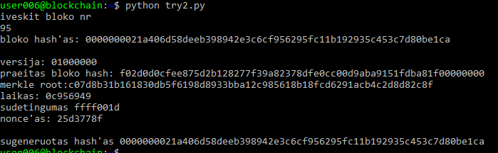

# Blockchain 3 užduotis
bitcoin mazgo tyrinėjimas su python-bitcoinlib biblioteka

## 1. tranzakcijos mokesčio apskaičiavimas

```python
from bitcoin.rpc import RawProxy

p = RawProxy()

# tranzakcijos id
txid = "0627052b6f28912f2703066a912ea577f2ce4da4caa5a5fbd8a57286c345c2f2"

raw_tx = p.getrawtransaction(txid)

# dekodinimas
decoded_tx = p.decoderawtransaction(raw_tx)

# suskaiciuojama visa tranzakcijos verte
tran_val = 0
for output in decoded_tx['vout']:
	tran_val=tran_val+output['value']


print("tranzakcijos visa verte: %f" % (tran_val))

# skaiciuojama praeitu inputu verte
tran_in=0
for out in decoded_tx['vin']:
	tx=out['txid']
	rawtx = p.getrawtransaction(tx)
	decodedtx = p.decoderawtransaction(rawtx)
	for o in decodedtx['vout']:
		tran_in=tran_in+o['value']

print("tranzakcijos mokestis: %f" % (tran_in-tran_val))
```


galima parašyt taip, kad tranzakcijos id būtų įvestinas 
```python
txid = raw_input()
```


## 2. bloko hash'o tikrinimas

Kodas, parodantis bloko esamą hash'ą bei generuojantis to bloko hash'ą pagal jo atributus

``` python
from bitcoin.rpc import RawProxy
import hashlib
p = RawProxy()
# funkcija skaiciu paversti i sesioliktaines string
def ChangeHex(n):
        he=""
        while n>0:
                x=(n%16)
                if (x<10):
                        he=str(x)+he
                if (x==10):
                        he="a"+he
                if (x==11):
                        he="b"+he
                if (x==12):
                        he="c"+he
                if (x==13):
                        he="d"+he
                if (x==14):
                        he="e"+he
                if (x==15):
                        he="f"+he
                n=n/16
        while (len(he)<8):
                he="0"+he
        return he
# funkcija 'paversti' big endianini hex'a i small endian
def Swap(st):
        str=""
        i=0
        if len(st)%2>0:
                st="0"+st
        while i<len(st):
                str=st[i]+st[i+1]+str
                i=i+2
        return str

print "iveskit bloko nr"
blockheight = input()

blockhash = p.getblockhash(blockheight)

block = p.getblock(blockhash)
print "bloko hash'as: " + blockhash + "\n"
# sudedami bloko antrastes atributai i viena eilute
h= ''  .join([Swap(ChangeHex(block['version'])),Swap(block['previousblockhash']),Swap(block['merkleroot']),Swap(ChangeHex(block['time'])),Swap(block['bits']),Swap(ChangeHex(block['nonce']))
])
hh=["versija: "+Swap(ChangeHex(block['version'])),"praeitas bloko hash: "+Swap(block['previousblockhash']),"merkle root:"+Swap(block['merkleroot']),"laikas: "+Swap(ChangeHex(block['time']))
,"sudetingumas "+Swap(block['bits']),"nonce'as: "+Swap(ChangeHex(block['nonce']))]
for x in hh:
        print x
header_bin = h.decode('hex')
hash = hashlib.sha256(hashlib.sha256(header_bin).digest()).digest()
jj=hash[::-1].encode('hex_codec')
print "\nsugeneruotas hash'as " + jj
```

