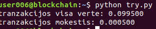
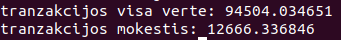

# Blockchain 3 užduotis
bitcoin mazgo tyrinėjimas su python-bitcoinlib biblioteka

## 1. tranzakcijos mokesčio apskaičiavimas

```python
from bitcoin.rpc import RawProxy

p = RawProxy()

# tranzakcijos id
txid = "0627052b6f28912f2703066a912ea577f2ce4da4caa5a5fbd8a57286c345c2f2"

raw_tx = p.getrawtransaction(txid)

# dekodinimas
decoded_tx = p.decoderawtransaction(raw_tx)

# suskaiciuojama visa tranzakcijos verte
tran_val = 0
for output in decoded_tx['vout']:
	tran_val=tran_val+output['value']


print("tranzakcijos visa verte: %f" % (tran_val))

# skaiciuojama praeitu inputu verte
tran_in=0
for out in decoded_tx['vin']:
	tx=out['txid']
	rawtx = p.getrawtransaction(tx)
	decodedtx = p.decoderawtransaction(rawtx)
	for o in decodedtx['vout']:
		tran_in=tran_in+o['value']

print("tranzakcijos mokestis: %f" % (tran_in-tran_val))
```


galima parašyt taip, kad tranzakcijos id būtų įvestinas 
```python
txid = raw_input()
```



